<div align="center">

<!-- ═══════════════ ANIMATED HEADER ═══════════════ -->


<!-- ═══════════════ TYPING ANIMATION ═══════════════ -->
<a href="https://github.com/vaibhav343343">
  
</a>

<br/><br/>

<!-- ═══════════════ SOCIAL BADGES ═══════════════ -->
[](https://github.com/vaibhav343343)
[](https://www.linkedin.com/in/vaibhav-sudrik-aa59ab34a)
[](https://www.kaggle.com/vaibhavsudrik2005)
[](mailto:vaibhavsudrik2005@gmail.com)

<br/>

<!-- ═══════════════ VISITOR COUNTER ═══════════════ -->

[](https://github.com/vaibhav343343?tab=followers)
[](https://github.com/vaibhav343343)

</div>

---

## 🧠 About Me



```python
class DataScientist:
    name     = "Vaibhav Sudrik"
    location = "🇮🇳 India"
    role     = "Aspiring Data Scientist"

    education = "Cloud Computing Graduate"

    passions  = [
        "Generative AI & LLMs",
        "End-to-End ML Pipelines",
        "Big Data Engineering",
        "Cloud Architecture (AWS)",
    ]

    currently_learning = [
        "RAG Systems & Vector DBs",
        "MLOps & Model Serving",
        "Agentic AI Frameworks",
    ]

    fun_fact = "I turn raw data into actionable gold 📊"
```

<br/>

- 🎓 **Cloud Computing Graduate** with deep expertise in AI, ML & Generative AI
- 🤖 Building **end-to-end ML pipelines** — from raw data to production-ready models
- ☁️ Experienced in **AWS cloud architecture** and cloud-native data engineering
- 📊 Skilled at transforming messy data into insights with **Power BI** dashboards
- 🔬 Actively exploring **LLMs**, **RAG systems**, and modern Gen AI toolchains
- 🚀 Believer in open-source, continuous learning, and building in public

<br clear="right"/>

---

## 🛠️ Tech Stack

<div align="center">

### 🐍 Languages & Databases


### 🤖 ML / AI & Data Science


### 🌊 Big Data & Analytics


### ☁️ Cloud & DevOps


### 🛠️ Tools & Frameworks


</div>

<div align="center">
<br/>

<!-- Extended badges for tools not in skillicons -->
| NumPy | Pandas | Spark | Hive | Power BI | Matplotlib | Seaborn | Scikit-Learn |
|:---:|:---:|:---:|:---:|:---:|:---:|:---:|:---:|
|  |  |  |  |  |  |  |  |

| LangChain | HuggingFace | OpenAI | MLflow | Airflow | Streamlit | FastAPI | Jupyter |
|:---:|:---:|:---:|:---:|:---:|:---:|:---:|:---:|
|  |  |  |  |  |  |  |  |

</div>

---

## 📊 GitHub Stats

<div align="center">


&nbsp;&nbsp;


</div>

<div align="center">


</div>

---

## 📈 Contribution Activity

<div align="center">


</div>

---

## 🏆 GitHub Trophies

<div align="center">


</div>

---

## 🐍 Contribution Snake

<div align="center">

<picture>
  <source media="(prefers-color-scheme: dark)" srcset="https://raw.githubusercontent.com/vaibhav343343/vaibhav343343/output/github-contribution-grid-snake-dark.svg"/>
  <source media="(prefers-color-scheme: light)" srcset="https://raw.githubusercontent.com/vaibhav343343/vaibhav343343/output/github-contribution-grid-snake.svg"/>
  
</picture>

</div>

---

## 🌐 3D Contribution Calendar

<div align="center">


</div>

---

## 🎯 Current Focus & Learning Path

<div align="center">

```
╔══════════════════════════════════════════════════════════════╗
║               🚀 2026 LEARNING ROADMAP                       ║
╠══════════════════════════════════════════════════════════════╣
║  ✅  End-to-End ML Pipeline (Data → Model → Deploy)          ║
║  ✅  AWS Cloud Architecture & Data Engineering               ║
║  ✅  Power BI Dashboards & Business Intelligence             ║
║  🔄  Advanced RAG Systems & Vector Databases                 ║
║  🔄  LLM Fine-tuning & Prompt Engineering                    ║
║  🔄  MLOps: CI/CD for ML, Model Monitoring                  ║
║  📋  Agentic AI Frameworks (LangGraph, AutoGen)              ║
║  📋  Real-Time Streaming with Kafka + Spark Structured       ║
╚══════════════════════════════════════════════════════════════╝
```

</div>

---

## 💡 Featured Skills

<div align="center">

| Domain | Skills | Level |
|--------|--------|-------|
| 🐍 **Programming** | Python, SQL | ⭐⭐⭐⭐⭐ |
| 🤖 **Machine Learning** | Scikit-Learn, XGBoost, CatBoost | ⭐⭐⭐⭐ |
| 🧠 **Deep Learning** | TensorFlow, PyTorch, Keras | ⭐⭐⭐⭐ |
| 🌊 **Big Data** | Spark, Hadoop, Hive, Kafka | ⭐⭐⭐⭐ |
| ☁️ **Cloud** | AWS (S3, EC2, Lambda, SageMaker) | ⭐⭐⭐⭐ |
| 🔬 **Gen AI** | LangChain, HuggingFace, OpenAI API | ⭐⭐⭐ |
| 📊 **Data Viz** | Power BI, Matplotlib, Seaborn, Plotly | ⭐⭐⭐⭐ |
| ⚙️ **DevOps / MLOps** | Docker, Kubernetes, Git, GitHub Actions | ⭐⭐⭐ |

</div>

---

## 📫 Let's Connect!

<div align="center">

<a href="https://www.linkedin.com/in/vaibhav-sudrik-aa59ab34a">
  
</a>
&nbsp;
<a href="https://www.kaggle.com/vaibhavsudrik2005">
  
</a>
&nbsp;
<a href="mailto:vaibhavsudrik2005@gmail.com">
  
</a>

<br/><br/>

> 💼 **Open to**: Data Science Internships · ML Engineering Roles · AI Research Collaborations · Freelance Projects

</div>

---

<!-- ═══════════════ ANIMATED FOOTER ═══════════════ -->
<div align="center">

</div>
